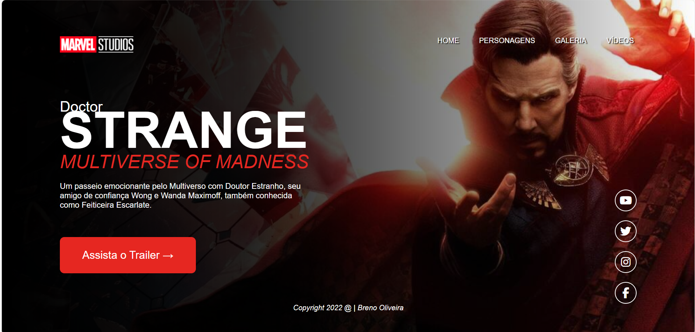

# Doctor-Stranger

 Projeto desenvolvido através do canal do youtube do professor Fernando Leonid.
 Nesse projeto é ele ensina como desenvolver um landin page do filme doctor strange, 
 ensinando passo a passo todo o processo para faze-la
 desde da imagem, icones, responsividade do site, e etc.
 Projeto ainda não concluido.

  

Créditos: Fernando Leonid
